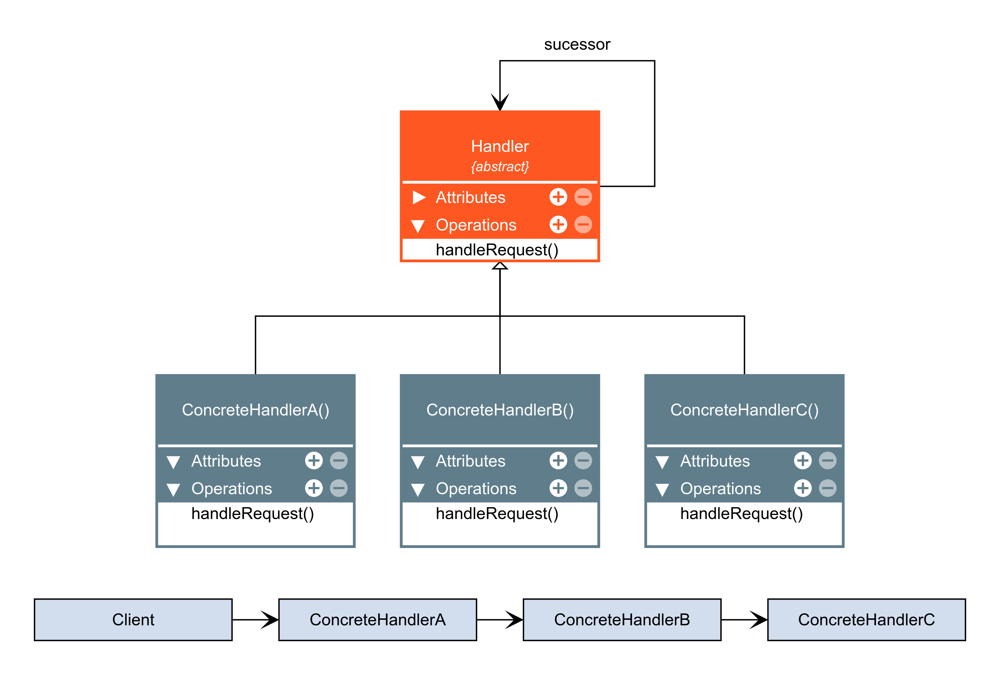

# Chain of responsibility

O Chain of Responsibility é um padrão de projeto comportamental que permite que você passe pedidos por uma corrente de handlers. Ao receber um pedido, cada handler decide se processa o pedido ou o passa adiante para o próximo handler na corrente.

### Aplicabilidade

- Utilize o padrão Chain of Responsibility quando é esperado que seu programa processe diferentes tipos de pedidos em várias maneiras, mas os exatos tipos de pedidos e suas sequências são desconhecidos de antemão.

    - O padrão permite que você ligue vários handlers em uma corrente e, ao receber um pedido, perguntar para cada handler se ele pode ou não processá-lo. Dessa forma todos os handlers tem a chance de processar o pedido.

- Utilize o padrão quando é essencial executar diversos handlers em uma ordem específica.

    - Já que você pode ligar os handlers em uma corrente em qualquer ordem, todos os pedidos irão atravessar a corrente exatamente como você planejou.

- Utilize o padrão CoR quando o conjunto de handlers e suas encomendas devem mudar no momento de execução.

    - Se você providenciar setters para um campo de referência dentro das classes handler, você será capaz de inserir, remover, ou reordenar os handlers de forma dinâmica.

|Vantagens|Desvantagens|
|:---:|:---:|
|Você pode controlar a ordem de tratamento dos pedidos.|Alguns pedidos podem acabar sem tratamento.|
|Princípio de responsabilidade única. Você pode desacoplar classes que invocam operações de classes que realizam operações.||
|Princípio aberto/fechado. Você pode introduzir novos handlers na aplicação sem quebrar o código cliente existente.||

### Diagrama

