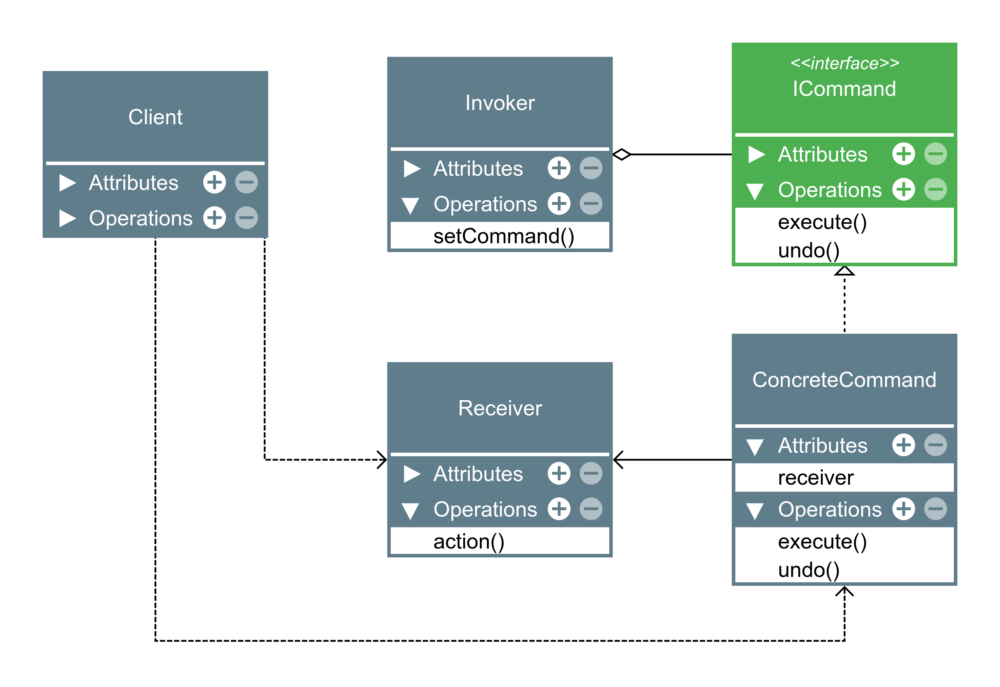

# Command

O Command é um padrão de projeto comportamental que transforma um pedido em um objeto independente que contém toda a informação sobre o pedido. Essa transformação permite que você parametrize métodos com diferentes pedidos, atrase ou coloque a execução do pedido em uma fila, e suporte operações que não podem ser feitas.

### Aplicabilidade

- Utilize o padrão Command quando você quer parametrizar objetos com operações.
    
    - O padrão Command podem tornar uma chamada específica para um método em um objeto separado. Essa mudança abre várias possibilidades de usos interessantes: você pode passar comandos como argumentos do método, armazená-los dentro de outros objetos, trocar comandos ligados no momento de execução, etc.

    - Aqui está um exemplo: você está desenvolvendo um componente GUI como um menu de contexto, e você quer que os usuários sejam capazes de configurar os items do menu que aciona as operações quando um usuário clica em um item.

- Utilize o padrão Command quando você quer colocar operações em fila, agendar sua execução, ou executá-las remotamente.

    - Como qualquer outro objeto, um comando pode ser serializado, o que significa convertê-lo em uma string que pode ser facilmente escrita em um arquivo ou base de dados. Mais tarde a string pode ser restaurada no objeto comando inicial. Dessa forma você pode adiar e agendar execuções do comando. Mas isso não é tudo! Da mesma forma, você pode colocar em fila, fazer registro de log ou enviar comandos por uma rede.

- Utilize o padrão Command quando você quer implementar operações reversíveis.

    - Embora haja muitas formas de implementar o desfazer/refazer, o padrão Command é talvez a mais popular de todas.

    - Para ser capaz de reverter operações, você precisa implementar o histórico de operações realizadas. O histórico do comando é uma pilha que contém todos os objetos comando executados junto com seus backups do estado da aplicação relacionados.

    - Esse método tem duas desvantagens. Primeiro, se não for fácil salvar o estado da aplicação por parte dela ser privada. Esse problema pode ser facilmente mitigado com o padrão Memento.

    - Segundo, os backups de estado podem consumir uma considerável quantidade de RAM. Portanto, algumas vezes você pode recorrer a uma implementação alternativa: ao invés de restaurar a um estado passado, o comando faz a operação inversa. A operação reversa também cobra um preço: ela pode ter sua implementação difícil ou até impossível.

|Vantagens|Desvantagens|
|:---:|:---:|
|Princípio de responsabilidade única. Você pode desacoplar classes que invocam operações de classes que fazem essas operações.|O código pode ficar mais complicado uma vez que você está introduzindo uma nova camada entre remetentes e destinatários.|
|Princípio aberto/fechado. Você pode introduzir novos comandos na aplicação sem quebrar o código cliente existente||
|Você pode implementar desfazer/refazer.||
|Você pode implementar a execução adiada de operações.||
|Você pode montar um conjunto de comandos simples em um complexo.||

### Diagrama

