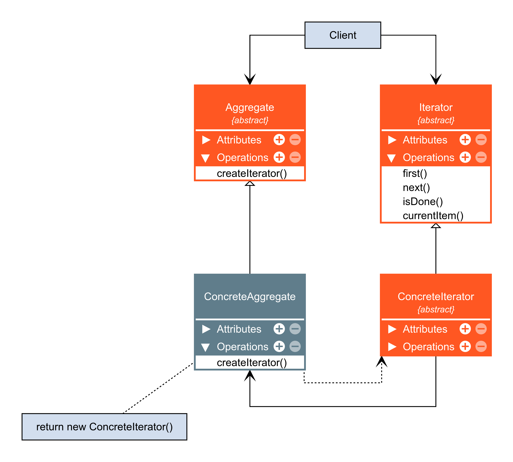

# Iterator

O Iterator é um padrão de projeto comportamental que permite a você percorrer elementos de uma coleção sem expor as representações dele (lista, pilha, árvore, etc.)

### Aplicabilidade

- Utilize o padrão Iterator quando sua coleção tiver uma estrutura de dados complexa por debaixo dos panos, mas você quer esconder a complexidade dela de seus clientes (seja por motivos de conveniência ou segurança).

    - O iterador encapsula os detalhes de se trabalhar com uma estrutura de dados complexa, fornecendo ao cliente vários métodos simples para acessar os elementos da coleção. Embora essa abordagem seja muito conveniente para o cliente, ela também protege a coleção de ações descuidadas ou maliciosas que o cliente poderia fazer se estivesse trabalhando com as coleções diretamente.

- Utilize o padrão para reduzir a duplicação de código de travessia em sua aplicação.

    - O código de algoritmos de iteração não triviais tendem a ser muito pesados. Quando colocados dentro da lógica de negócio da aplicação, ele pode desfocar a responsabilidade do codigo original e torná-lo um código de difícil manutenção. Mover o código de travessia para os iteradores designados pode ajudar você a tornar o código da aplicação mais enxuto e limpo.

- Utilize o Iterator quando você quer que seu código seja capaz de percorrer diferentes estruturas de dados ou quando os tipos dessas estruturas são desconhecidos de antemão.

    - O padrão fornece um par de interfaces genérica tanto para coleções como para iteradores. Já que seu código agora usa essas interfaces, ele ainda vai funcionar se você passar diversos tipos de coleções e iteradores que implementam essas interfaces.

|Vantagens|Desvantagens|
|:---:|:---:|
|Princípio de responsabilidade única. Você pode limpar o código cliente e as coleções ao extrair os pesados algoritmos de travessia para classes separadas.|Aplicar o padrão pode ser um preciosismo se sua aplicação só trabalha com coleções simples.|
|Princípio aberto/fechado. Você pode implementar novos tipos de coleções e iteradores e passá-los para o código existente sem quebrar coisa alguma.|Usar um iterador pode ser menos eficiente que percorrer elementos de algumas coleções especializadas diretamente.|
|Você pode iterar sobre a mesma coleção em paralelo porque cada objeto iterador contém seu próprio estado de iteração.||
|Pelas mesmas razões, você pode atrasar uma iteração e continuá-la quando necessário.||

### Diagrama

