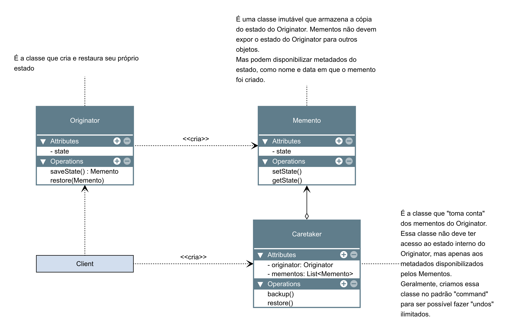

# Memento

O Memento é um padrão de projeto comportamental que permite que você salve e restaure o estado anterior de um objeto sem revelar os detalhes de sua implementação.

### Aplicabilidade

- Utilize o padrão Memento quando você quer produzir retratos do estado de um objeto para ser capaz de restaurar um estado anterior do objeto.

    - O padrão Memento permite que você faça cópias completas do estado de um objeto, incluindo campos privados, e armazená-los separadamente do objeto. Embora a maioria das pessoas vão lembrar desse padrão graças ao caso “desfazer”, ele também é indispensável quando se está lidando com transações (isto é, se você precisa reverter uma operação quando se depara com um erro).

- Utilize o padrão quando o acesso direto para os campos/getters/setters de um objeto viola seu encapsulamento.

    - O Memento faz o próprio objeto ser responsável por criar um retrato de seu estado. Nenhum outro objeto pode ler o retrato, fazendo do estado original do objeto algo seguro e confiável.

|Vantagens|Desvantagens|
|:---:|:---:|
|Você pode produzir retratos do estado de um objeto sem violar seu encapsulamento.|A aplicação pode consumir muita RAM se os clientes criarem mementos com muita frequência.|
|Você pode simplificar o código da originadora permitindo que a cuidadora mantenha o histórico do estado da originadora.|Cuidadoras devem acompanhar o ciclo de vida da originadora para serem capazes de destruir mementos obsoletos.|
||A maioria das linguagens de programação dinâmicas, tais como PHP, Python, e JavaScript, não conseguem garantir que o estado dentro do memento permaneça intacto.|

### Diagramas

