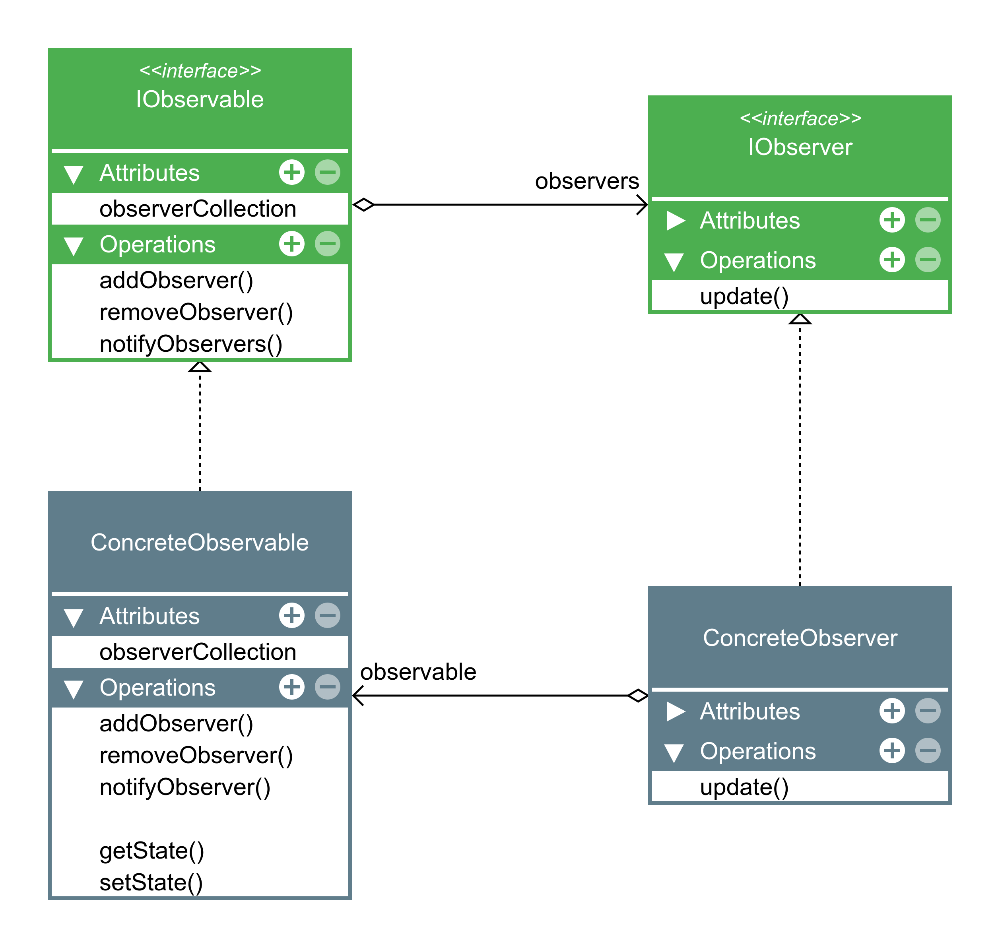

# Observer

O Observer é um padrão de projeto comportamental que permite que você defina um mecanismo de assinatura para notificar múltiplos objetos sobre quaisquer eventos que aconteçam com o objeto que eles estão observando.

### Aplicabilidade

- Utilize o padrão Observer quando mudanças no estado de um objeto podem precisar mudar outros objetos, e o atual conjunto de objetos é desconhecido de antemão ou muda dinamicamente.

    - Você pode vivenciar esse problema quando trabalhando com classes de interface gráfica do usuário. Por exemplo, você criou classes de botões customizados, e você quer deixar os clientes colocar algum código customizado para seus botões para que ele ative sempre que usuário aperta um botão.

    - O padrão Observer permite que qualquer objeto que implemente a interface do assinante possa se inscrever para notificações de eventos em objetos da publicadora. Você pode adicionar o mecanismo de inscrição em seus botões, permitindo que o cliente coloque seu próprio código através de classes assinantes customizadas.

- Utilize o padrão quando alguns objetos em sua aplicação devem observar outros, mas apenas por um tempo limitado ou em casos específicos.

    - A lista de inscrição é dinâmica, então assinantes podem entrar e sair da lista sempre que quiserem.

|Vantagens|Desvantagens|
|:---:|:---:|
|Princípio aberto/fechado. Você pode introduzir novas classes assinantes sem ter que mudar o código da publicadora (e vice versa se existe uma interface publicadora).|Assinantes são notificados em ordem aleatória|
|Você pode estabelecer relações entre objetos durante a execução.||

### Diagramas

