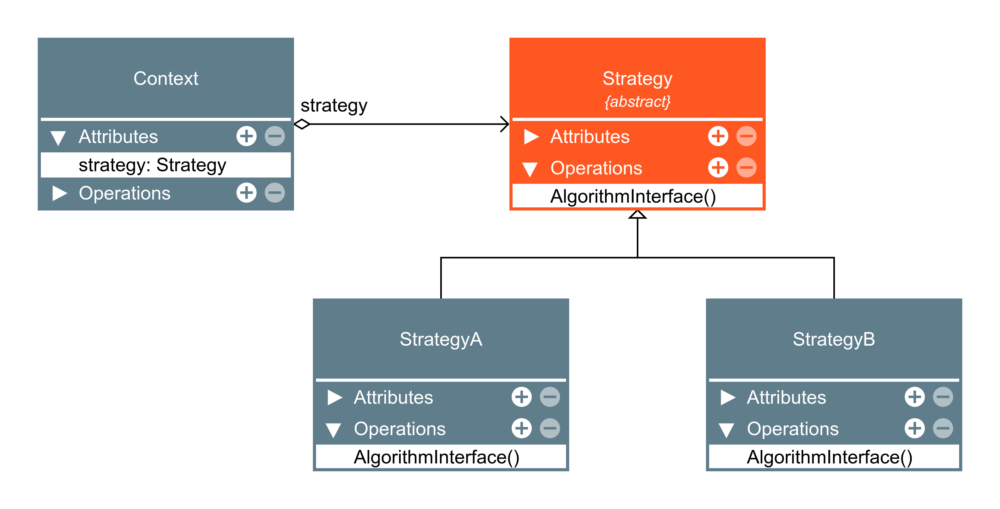

# Strategy

O Strategy é um padrão de projeto comportamental que permite que você defina uma família de algoritmos, coloque-os em classes separadas, e faça os objetos deles intercambiáveis.

### Aplicabilidade

- Utilize o padrão Strategy quando você quer usar diferentes variantes de um algoritmo dentro de um objeto e ser capaz de trocar de um algoritmo para outro durante a execução.

    - O padrão Strategy permite que você altere indiretamente o comportamento de um objeto durante a execução ao associá-lo com diferentes sub-objetos que pode fazer sub-tarefas específicas em diferentes formas.

- Utilize o Strategy quando você tem muitas classes parecidas que somente diferem na forma que elas executam algum comportamento.

    - O padrão Strategy permite que você extraia o comportamento variante para uma hierarquia de classe separada e combine as classes originais em uma, portando reduzindo código duplicado.

- Utilize o padrão para isolar a lógica do negócio de uma classe dos detalhes de implementação de algoritmos que podem não ser tão importantes no contexto da lógica.

    - O padrão Strategy permite que você isole o código, dados internos, e dependências de vários algoritmos do restante do código. Vários clientes podem obter uma simples interface para executar os algoritmos e trocá-los durante a execução do programa.

- Utilize o padrão quando sua classe tem um operador condicional muito grande que troca entre diferentes variantes do mesmo algoritmo.

    - O padrão Strategy permite que você se livre dessa condicional ao extrair todos os algoritmos para classes separadas, todos eles implementando a mesma interface. O objeto original delega a execução de um desses objetos, ao invés de implementar todas as variantes do algoritmo.

|Vantagens|Desvantages|
|:---:|:---:|
|Você pode trocar algoritmos usados dentro de um objeto durante a execução.|Se você só tem um par de algoritmos e eles raramente mudam, não há motivo real para deixar o programa mais complicado com novas classes e interfaces que vêm junto com o padrão.|
|Você pode isolar os detalhes de implementação de um algoritmo do código que usa ele.|Os Clientes devem estar cientes das diferenças entre as estratégias para serem capazes de selecionar a adequada.|
|Você pode substituir a herança por composição.|Muitas linguagens de programação modernas tem suporte do tipo funcional que permite que você implemente diferentes versões de um algoritmo dentro de um conjunto de funções anônimas. Então você poderia usar essas funções exatamente como se estivesse usando objetos estratégia, mas sem inchar seu código com classes e interfaces adicionais.|
|Princípio aberto/fechado. Você pode introduzir novas estratégias sem mudar o contexto.||

### Diagramas

`exemplo:`

[Strategy](./strategy.py)