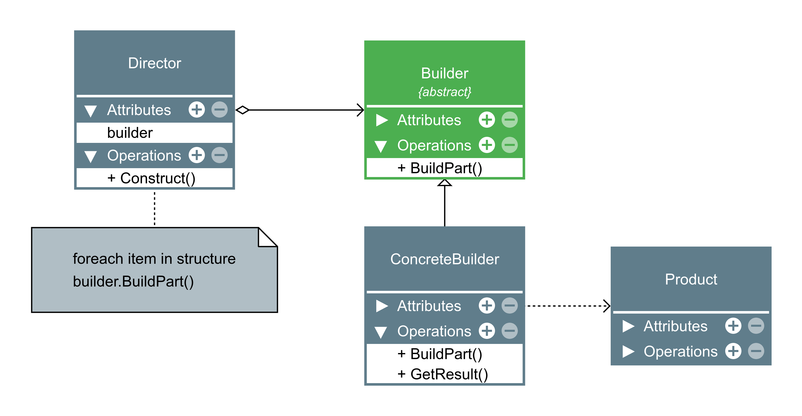

# Builder

- O Builder é um padrão de projeto criacional que permite a você construir objetos complexos passo a passo. O padrão permite que você produza diferentes tipos e representações de um objeto usando o mesmo código de construção.

-  Builder te da a possibilidade de criar objetos passo-a-passo e isso já é possível no Python sem este padrão.

- Geralmente o builder aceita o encadeamento de métodos (method chaining).

###  Aplicabilidade:

- Use o padrão Builder para se livrar de um “construtor telescópico”.

    - Digamos que você tenha um construtor com dez parâmetros opcionais. Chamar um monstro desses é muito inconveniente; portanto, você sobrecarrega o construtor e cria diversas versões curtas com menos parâmetros. Esses construtores ainda se referem ao principal, passando alguns valores padrão para qualquer parâmetro omitido.

    - O padrão Builder permite que você construa objetos passo a passo, usando apenas aquelas etapas que você realmente

- Use o padrão Builder quando você quer que seu código seja capaz de criar diferentes representações do mesmo produto (por exemplo, casas de pedra e madeira).

    - O padrão Builder pode ser aplicado quando a construção de várias representações do produto envolvem etapas similares que diferem apenas nos detalhes.

    - A interface base do builder define todas as etapas de construção possíveis, e os buildrs concretos implementam essas etapas para construir representações particulares do produto. Enquanto isso, a classe diretor guia a ordem de construção.

- Use o Builder para construir árvores Composite ou outros objetos complexos.

    - O padrão Builder permite que você construa produtos passo a passo. Você pode adiar a execução de algumas etapas sem quebrar o produto final. Você pode até chamar etapas recursivamente, o que é bem útil quando você precisa construir uma árvore de objetos.

    - Um builder não expõe o produto não finalizado enquanto o processo de construção estiver executando etapas. Isso previne o código cliente de obter um resultado incompleto.

|Vantagens|Desvantagens|
|:---:|:---:|
|Você pode construir objetos passo a passo, adiar as etapas de construção ou rodar etapas recursivamente.|A complexidade geral do código aumenta uma vez que o padrão exige criar múltiplas classes novas.|
|Você pode reutilizar o mesmo código de construção quando construindo várias representações de produtos.||
| Princípio de responsabilidade única. Você pode isolar um código de construção complexo da lógica de negócio do produto.||

`exemplo:`

[Builder](./builder.py)
