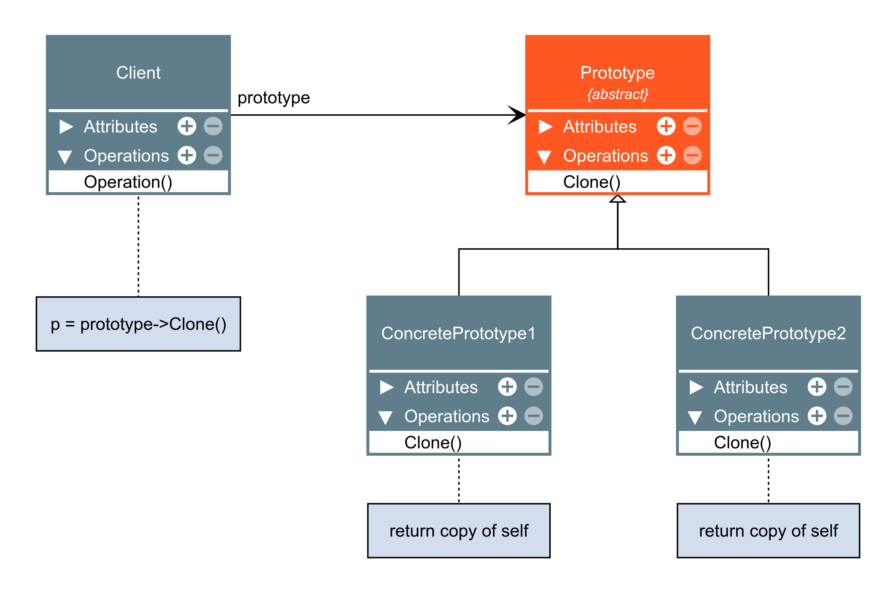

# Prototype

Especificar os tipos de objetos a serem criados
usando uma instância-protótipo e criar novos objetos pela cópia desse protótipo

|Mutaveis|Imutaveis|
|:---:|:---:|
|"passados por referência"|"copiados"|
|||
|list|bool|
|set|int|
|dict|float|
|class(o usuario pode alterar isto)|tuple|
||str|

### Diagrama

`exemplo:`

[Prototype](./prototype.py)