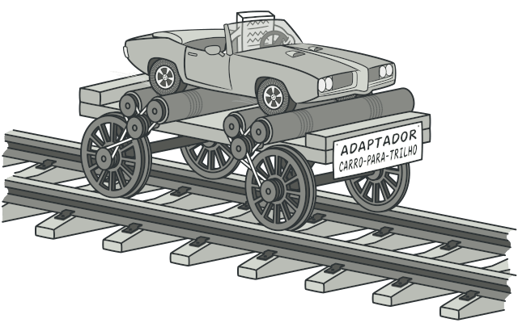

# Adapter

O Adapter é um padrão de projeto estrutural que permite objetos com interfaces incompatíveis colaborarem entre si.

### Aplicabilidade

- Utilize a classe Adaptador quando você quer usar uma classe existente, mas sua interface não for compatível com o resto do seu código.

    - O padrão Adapter permite que você crie uma classe de meio termo que serve como um tradutor entre seu código e a classe antiga, uma classe de terceiros, ou qualquer outra classe com uma interface estranha.

- Utilize o padrão quando você quer reutilizar diversas subclasses existentes que não possuam alguma funcionalidade comum que não pode ser adicionada a superclasse.

    - Você pode estender cada subclasse e colocar a funcionalidade faltante nas novas classes filhas. Contudo, você terá que duplicar o código em todas as novas classes, o que cheira muito mal.

    - Uma solução muito mais elegante seria colocar a funcionalidade faltante dentro da classe adaptadora. Então você encobriria os objetos com as funcionalidades faltantes dentro do adaptador, ganhando tais funcionalidades de forma dinâmica. Para isso funcionar, as classes alvo devem ter uma interface em comum, e o campo do adaptador deve seguir aquela interface. Essa abordagem se parece muito com o padrão Decorator.

|Vantagens|Desvantagens|
|:---:|:---:|
|Princípio de responsabilidade única. Você pode separar a conversão de interface ou de dados da lógica primária do negócio do programa.|A complexidade geral do código aumenta porque você precisa introduzir um conjunto de novas interfaces e classes. Algumas vezes é mais simples mudar a classe serviço para que ela se adeque com o resto do seu código.|
|Princípio aberto/fechado. Você pode introduzir novos tipos de adaptadores no programa sem quebrar o código cliente existente, desde que eles trabalhem com os adaptadores através da interface cliente.||

### Diagramas

- Classe

    

- Objeto

    
