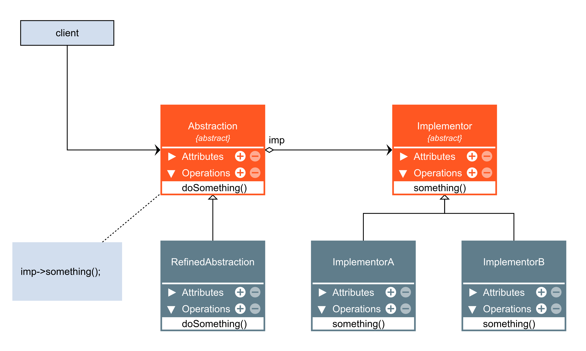

# Bridge

O Bridge é um padrão de projeto estrutural que permite que você divida uma classe grande ou um conjunto de classes intimamente ligadas em duas hierarquias separadas por abstração e implementação, que podem ser desenvolvidas independentemente umas das outras.

### Aplicabilidade

- Utilize o padrão Bridge quando você quer dividir e organizar uma classe monolítica que tem diversas variantes da mesma funcionalidade (por exemplo, se a classe pode trabalhar com diversos servidores de base de dados).

    - Quanto maior a classe se torna, mais difícil é de entender como ela funciona, e mais tempo se leva para fazer mudanças. As mudanças feitas para uma das variações de funcionalidade podem precisar de mudanças feitas em toda a classe, o que quase sempre resulta em erros ou falha em lidar com efeitos colaterais.

    - O padrão Bridge permite que você divida uma classe monolítica em diversas hierarquias de classe. Após isso, você pode modificar as classes em cada hierarquia independentemente das classes nas outras. Essa abordagem simplifica a manutenção do código e minimiza o risco de quebrar o código existente.

- Utilize o padrão quando você precisa estender uma classe em diversas dimensões ortogonais (independentes).

    - O Bridge sugere que você extraia uma hierarquia de classe separada para cada uma das dimensões. A classe original delega o trabalho relacionado para os objetos pertencentes àquelas hierarquias ao invés de fazer tudo por conta própria.

- Utilize o Bridge se você precisar ser capaz de trocar implementações durante o momento de execução.

    - Embora seja opcional, o padrão Bridge permite que você substitua o objeto de implementação dentro da abstração. É tão fácil quanto designar um novo valor para um campo.

    - A propósito, este último item é o maior motivo pelo qual muitas pessoas confundem o Bridge com o padrão Strategy. Lembre-se que um padrão é mais que apenas uma maneira de estruturar suas classes. Ele também pode comunicar intenções e resolver um problema.

|Vantagens|Desvantagens|
|:---:|:---:|
|Você pode criar classes e aplicações independentes de plataforma.|Você pode tornar o código mais complicado ao aplicar o padrão em uma classe altamente coesa.|
|O código cliente trabalha com abstrações em alto nível. Ele não fica exposto a detalhes de plataforma.||
|Princípio aberto/fechado. Você pode introduzir novas abstrações e implementações independentemente uma das outras.||
|Princípio de responsabilidade única. Você pode focar na lógica de alto nível na abstração e em detalhes de plataforma na implementação.||

### Diagramas

