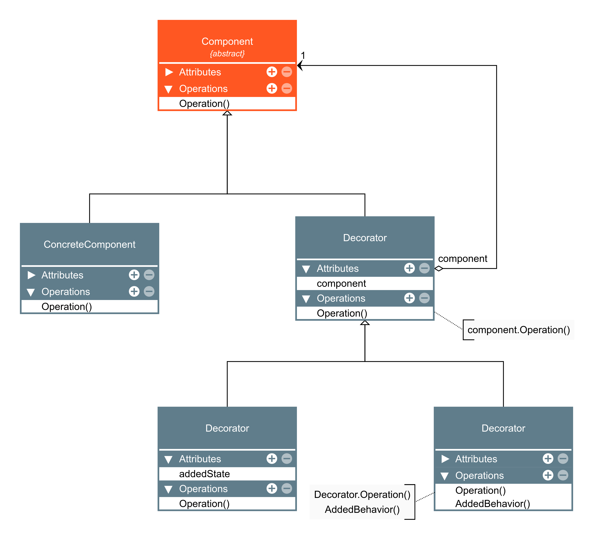
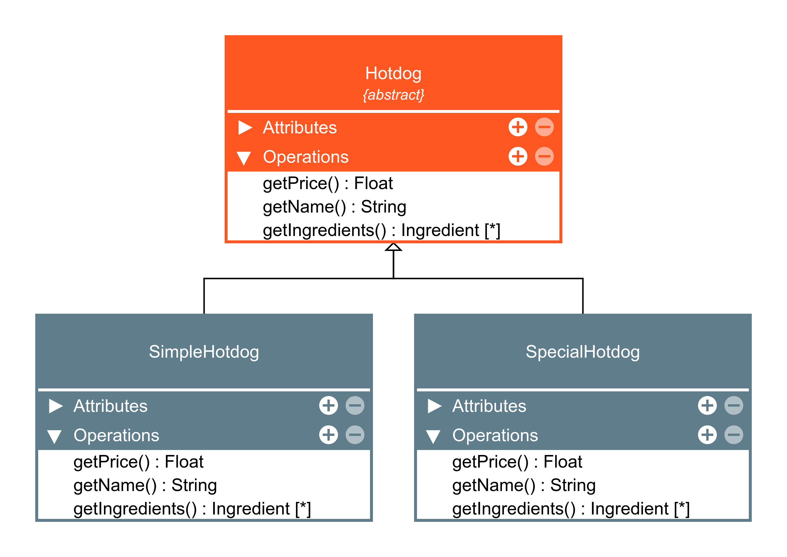
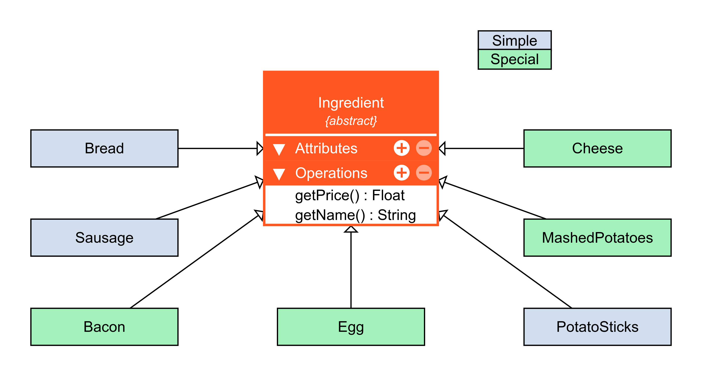

# Decorator

O Decorator é um padrão de projeto estrutural que permite que você acople novos comportamentos para objetos ao colocá-los dentro de invólucros de objetos que contém os comportamentos.

### Aplicabilidade

- Utilize o padrão Decorator quando você precisa ser capaz de projetar comportamentos adicionais para objetos em tempo de execução sem quebrar o código que usa esses objetos.

    - O Decorator lhe permite estruturar sua lógica de negócio em camadas, criar um decorador para cada camada, e compor objetos com várias combinações dessa lógica durante a execução. O código cliente pode tratar de todos esses objetos da mesma forma, como todos seguem a mesma interface comum.

- Utilize o padrão quando é complicado ou impossível estender o comportamento de um objeto usando herança.

    - Muitas linguagens de programação tem a palavra chave final que pode ser usada para prevenir a extensão de uma classe. Para uma classe final, a única maneira de reutilizar seu comportamento existente seria envolver a classe com seu próprio invólucro usando o padrão Decorator.

|Vantaegens|Desvantages|
|:---:|:---:|
|Você pode estender o comportamento de um objeto sem fazer um nova subclasse.|É difícil remover um invólucro de uma pilha de invólucros.|
|Você pode adicionar ou remover responsabilidades de um objeto no momento da execução.|É difícil implementar um decorador de tal maneira que seu comportamento não dependa da ordem do pilha de decoradores.
|Você pode combinar diversos comportamentos ao envolver o objeto com múltiplos decoradores.|A configuração inicial do código de camadas pode ficar bastante feia.|
|Princípio de responsabilidade única. Você pode dividir uma classe monolítica que implementa muitas possíveis variantes de um comportamento em diversas classes menores.||

### Diagramas

