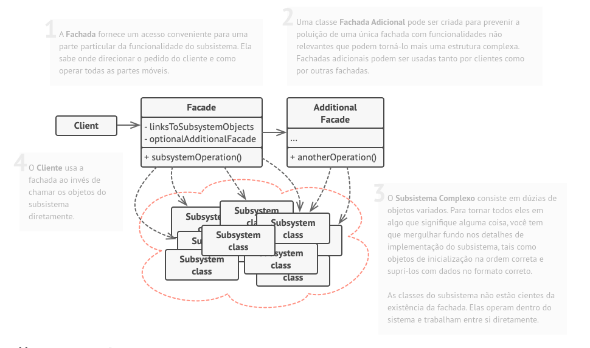

# Facade 

O Facade é um padrão de projeto estrutural que fornece uma interface simplificada para uma biblioteca, um framework, ou qualquer conjunto complexo de classes.

### Aplicabilidade

- Utilize o padrão Facade quando você precisa ter uma interface limitada mas simples para um subsistema complexo.

    - Com o passar do tempo, subsistemas ficam mais complexos. Até mesmo aplicar padrões de projeto tipicamente leva a criação de mais classes. Um subsistema pode tornar-se mais flexível e mais fácil de se reutilizar em vários contextos, mas a quantidade de códigos padrão e de configuração que ele necessita de um cliente cresce cada vez mais. O Facade tenta consertar esse problema fornecendo um atalho para as funcionalidades mais usadas do subsistema que corresponde aos requerimentos do cliente.

- Utilize o Facade quando você quer estruturar um subsistema em camadas.

    - Crie fachadas para definir pontos de entrada para cada nível de um subsistema. Você pode reduzir o acoplamento entre múltiplos subsistemas fazendo com que eles se comuniquem apenas através de fachadas.

    - Por exemplo, vamos retornar ao nosso framework de conversão de vídeo. Ele pode ser quebrado em duas camadas: relacionados a vídeo e áudio. Para cada camada, você cria uma fachada e então faz as classes de cada camada se comunicarem entre si através daquelas fachadas. Essa abordagem se parece muito com o padrão Mediator.

|Vantagens|Desvantagens|
|:---:|:---:|
|Você pode isolar seu código da complexidade de um subsistema.|Uma fachada pode se tornar um objeto deus acoplado a todas as classes de uma aplicação.|

### Diagrama

