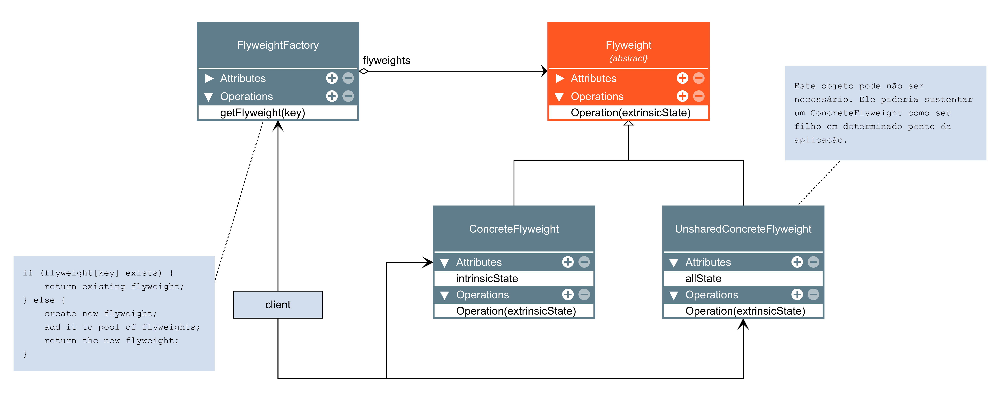

# Flyweight

O Flyweight é um padrão de projeto estrutural que permite a você colocar mais objetos na quantidade de RAM disponível ao compartilhar partes comuns de estado entre os múltiplos objetos ao invés de manter todos os dados em cada objeto.

### Aplicabilidade

- Utilize o padrão Flyweight apenas quando seu programa deve suportar um grande número de objetos que mal cabem na RAM disponível.

    - O benefício de aplicar o padrão depende muito de como e onde ele é usado. Ele é mais útil quando:

        - uma aplicação precisa gerar um grande número de objetos similares

        - isso drena a RAM disponível no dispositivo alvo

        - os objetos contém estados duplicados que podem ser extraídos e compartilhados entre múltiplos objetos

### Diagrama

