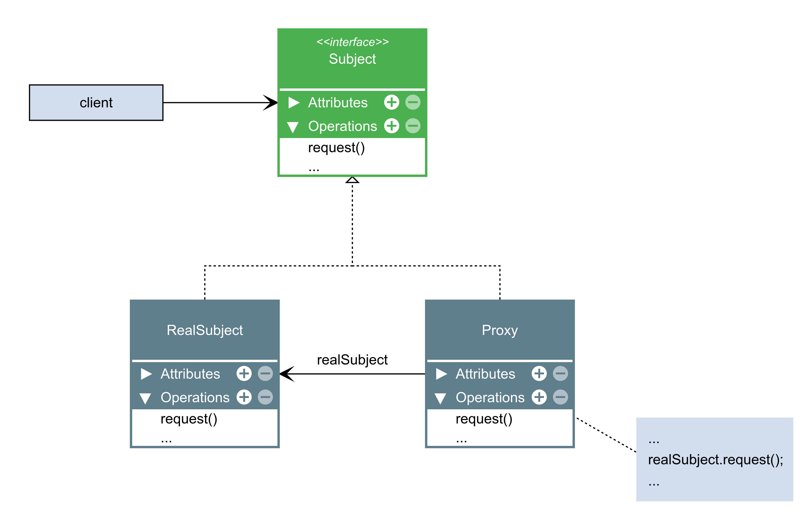

# Proxy

O Proxy é um padrão de projeto estrutural que permite que você forneça um substituto ou um espaço reservado para outro objeto. Um proxy controla o acesso ao objeto original, permitindo que você faça algo ou antes ou depois do pedido chegar ao objeto original.

### Aplicabilidade

- Inicialização preguiçosa (proxy virtual). Este é quando você tem um objeto do serviço peso-pesado que gasta recursos do sistema por estar sempre rodando, mesmo quando você precisa dele de tempos em tempos.

    - Ao invés de criar um objeto quando a aplicação inicializa, você pode atrasar a inicialização do objeto para um momento que ele é realmente necessário.

- Controle de acesso (proxy de proteção). Este é quando você quer que apenas clientes específicos usem o objeto do serviço; por exemplo, quando seus objetos são partes cruciais de um sistema operacional e os clientes são várias aplicações iniciadas (incluindo algumas maliciosas).

    - O proxy pode passar o pedido para o objeto de serviço somente se as credenciais do cliente coincidem com certos critérios.

- Execução local de um serviço remoto (proxy remoto). Este é quando o objeto do serviço está localizado em um servidor remoto.

    - Neste caso, o proxy passa o pedido do cliente pela rede, lidando com todos os detalhes sujos pertinentes a se trabalhar com a rede.

- Registros de pedidos (proxy de registro). Este é quando você quer manter um histórico de pedidos ao objeto do serviço.

    - O proxy pode fazer o registro de cada pedido antes de passar ao serviço.

- Cache de resultados de pedidos (proxy de cache). Este é quando você precisa colocar em cache os resultados de pedidos do cliente e gerenciar o ciclo de vida deste cache, especialmente se os resultados são muito grandes.

    - O proxy pode implementar o armazenamento em cache para pedidos recorrentes que sempre acabam nos mesmos resultados. O proxy pode usar como parâmetros dos pedidos as chaves de cache.

- Referência inteligente. Este é para quando você precisa ser capaz de se livrar de um objeto peso-pesado assim que não há mais clientes que o usam.

    - O proxy pode manter um registro de clientes que obtiveram uma referência ao objeto serviço ou seus resultados. De tempos em tempos, o proxy pode verificar com os clientes se eles ainda estão ativos. Se a lista cliente ficar vazia, o proxy pode remover o objeto serviço e liberar os recursos de sistema que ficaram empatados.

    - O proxy pode também fiscalizar se o cliente modificou o objeto do serviço. Então os objetos sem mudança podem ser reutilizados por outros clientes.

|Vantagens|Desvantagens|
|:---:|:---:|
|Você pode controlar o objeto do serviço sem os clientes ficarem sabendo.|O código pode ficar mais complicado uma vez que você precisa introduzir uma série de novas classes.|
|Você pode gerenciar o ciclo de vida de um objeto do serviço quando os clientes não se importam mais com ele.|A resposta de um serviço pode ter atrasos.|
|O proxy trabalha até mesmo se o objeto do serviço ainda não está pronto ou disponível.||
|Princípio aberto/fechado. Você pode introduzir novos proxies sem mudar o serviço ou clientes.||

### Diagrama

